<div align="center">
<h1>Hello GREP</h1>

A command line mini grep clone app written in Rust.

**README Sections:**  [Installation](#installation) - [Options](#options) - [Examples](#examples) - [License](#license) - [Acknowledgements](#acknowledgements)

<!-- Badges -->
</div>

<!--  -->

---

## Installation

`hello_grep` is written in [Rust](https://www.rust-lang.org/), so you'll need to grab a Rust installation in order to compile it. The recommended way to install Rust for development is from the [official download page](https://www.rust-lang.org/tools/install), using rustup.

Once Rust is installed, you can compile `hello_grep` with Cargo:

```bash
$ git clone https://github.com/juliencrn/hello_grep.git
$ cd hello_grep
$ cargo build --release
$ ./target/release/hello_grep --version
hello_grep 0.1.0
```

## Options

```
hello_grep 0.1.0

USAGE:
    hello_grep [FLAGS] [OPTIONS] <pattern> [path]...

FLAGS:
    -i, --ignore-case            Make search case insensitive
    -c, --count                  Suppress normal output; instead print a count of matching lines for each input file.
        --color                  Activate color in output.
    -l, --files-with-matches     Suppress normal output; instead print the name of each input file from which output
                                 would normally have been printed. The scanning will stop on the first match.
    -L, --files-without-match    Suppress normal output; instead print the name of each input file from which no output
                                 would normally have been printed. The scanning will stop on the first match.
        --help                   Prints help information
    -v, --invert-match           Invert the sense of matching.
    -x, --line-regexp            Select only those matches that exactly match the whole line.
    -h, --no-filename            Suppress the prefixing of file names on output. This is the default when there is only
                                 one file to search.
    -n, --line-number            Show line number.
    -s, --stats                  Display match statistics at the end.
    -V, --version                Prints version information

OPTIONS:
    -m, --max-count <max>    Stop reading a file after NUM matching lines. [default: 1000]

ARGS:
    <pattern>
    <path>...
```

## Examples

### Case sensitive - insensitive (`-i, --ignore-case`)


### Count matches (`-c, --count`)

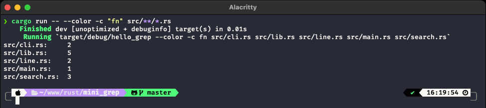

### Files glob

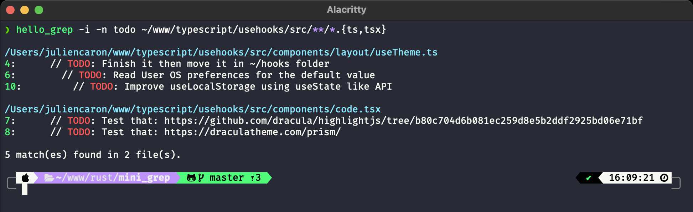

### Invert match (`-v, --invert-match`)

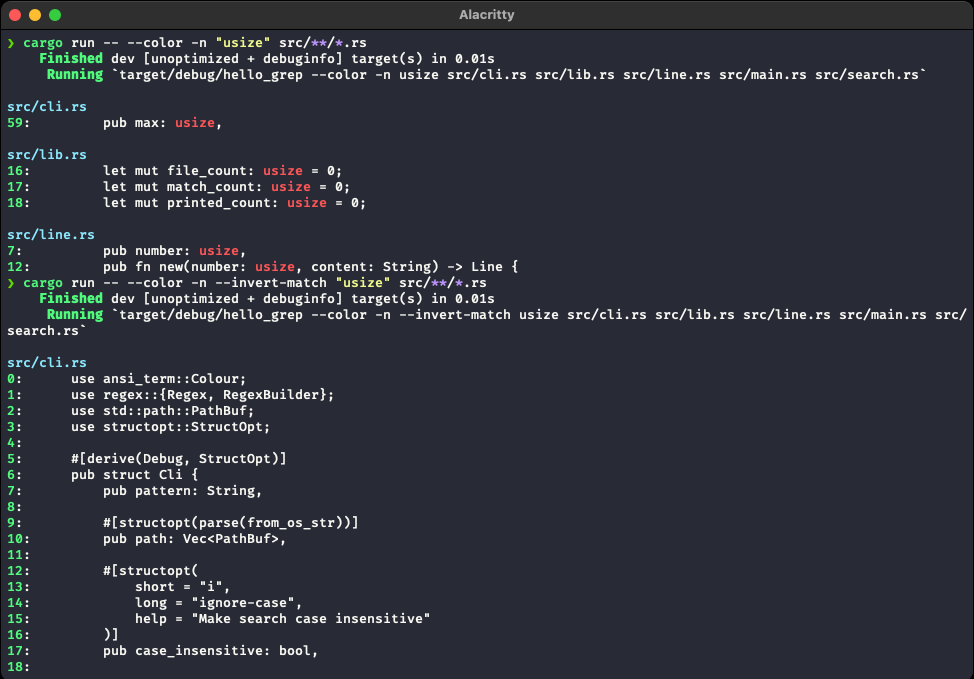

### Show statistics (`-s, --stats`)

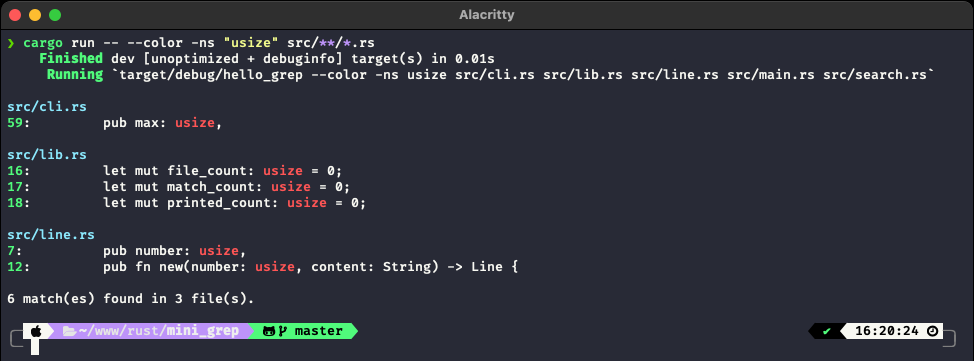

### RegExp

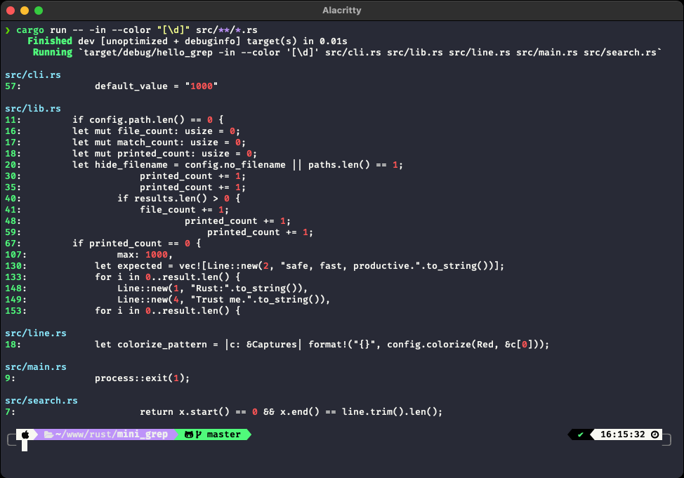
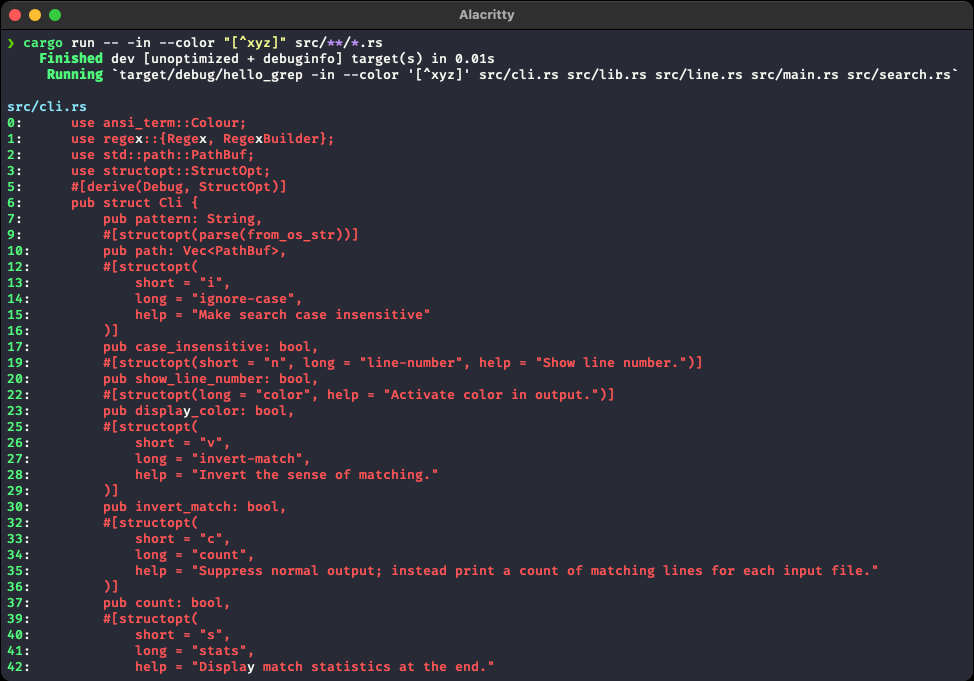
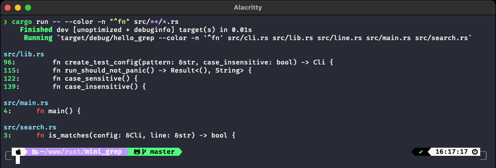
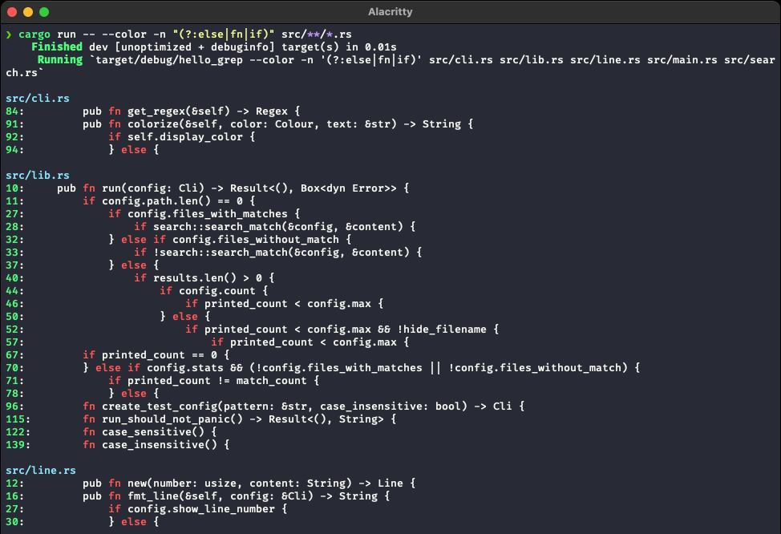

### echo output in a file

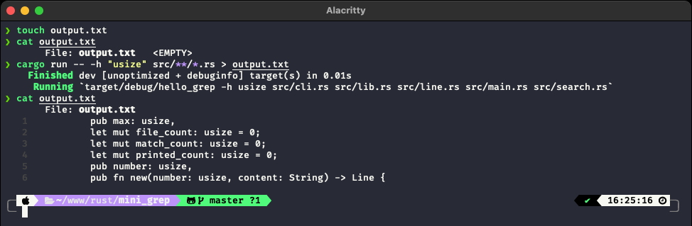

### Match whole line (`-x, --line-regexp`)

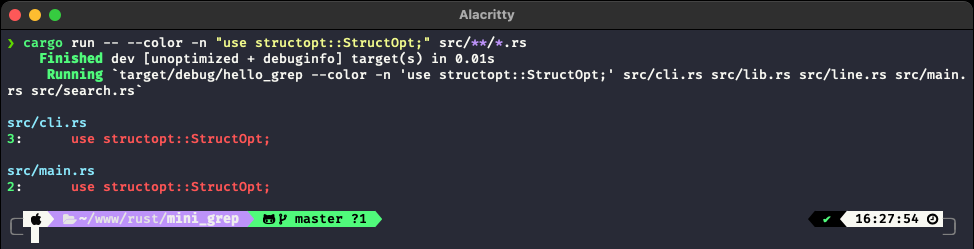

### Search files (`-l, -L`)

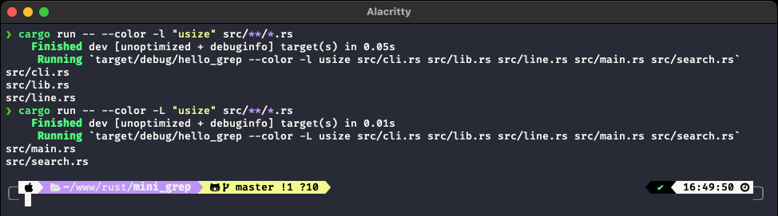

## License
Distributed under the MIT License. See [`LICENSE`](./LICENSE) for more information.

## Acknowledgements
* [Rust Book](https://doc.rust-lang.org/book/)
