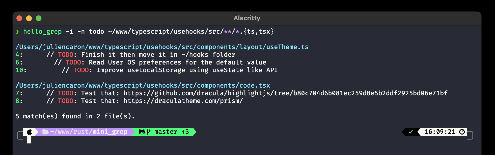

<h3 align="center">
    ⚠️  W.I.P.
</h3>
<br /> 


# Hello, Grep!
This personal learning project is just another grep clone, written in Rust.

<br />



## Getting Started
To get a local copy up and running follow these simple steps.

### Prerequisites
- This is a `rust` project, so you need have rust working on your machine. 
- We will use `git` to download the repository.

### Installation
1. Clone the repo
   ```sh
   git clone https://github.com/juliencrn/hello_grep.git
   cd hello_grep 
   ```
2. Compile and run
   ```sh
   cargo run -- -h  # To have documentation
   cargo test       # Or Run tests
   cargo run -- -i -n TODO ~/path/to/file # Or exec as grep
   cargo build --release # Production build
   ```

## Usage
```sh
hello_grep 0.1.0

USAGE:
    hello_grep [FLAGS] <pattern> [path]...

FLAGS:
    -i, --insensitive    Make search case insensitive
    -c, --color          Activate color in output
    -h, --help           Prints help information
    -n, --line-number    Show line number
    -V, --version        Prints version information

ARGS:
    <pattern>
    <path>...
```

## License
Distributed under the MIT License. See `LICENSE` for more information.

## Acknowledgements
* [Rust Book](https://doc.rust-lang.org/book/)
